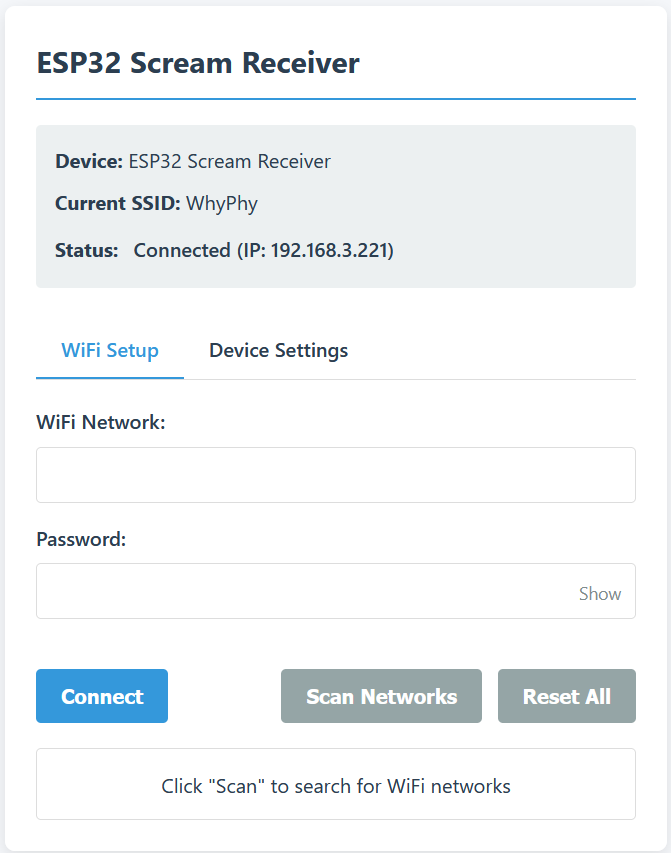
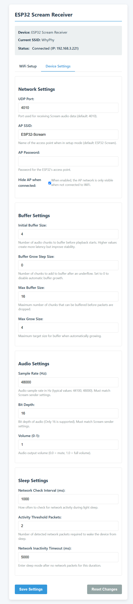

# ESP32 Scream Receiver

A WiFi-based audio streaming receiver for the Scream protocol, implemented on ESP32/ESP32-S3 microcontrollers.


* Note: This documentation is AI-generated and has not been vetted for accuracy.

## Table of Contents
- [Introduction](#introduction)
- [Features](#features)
- [Hardware Requirements](#hardware-requirements)
- [Getting Started](#getting-started)
  - [Setting Up the Receiver](#setting-up-the-receiver)
  - [Setting Up the Scream Driver on Windows](#setting-up-the-scream-driver-on-windows)
- [Web Configuration Interface](#web-configuration-interface)
  - [WiFi Setup](#wifi-setup)
  - [Device Settings](#device-settings)
- [Advanced Configuration](#advanced-configuration)
  - [Network Settings](#network-settings)
  - [Buffer Settings](#buffer-settings)
  - [Audio Settings](#audio-settings)
  - [Sleep Settings](#sleep-settings)
- [Hardware Setup](#hardware-setup)
  - [ESP32-S3 with USB DAC](#esp32-s3-with-usb-dac)
  - [ESP32 with SPDIF](#esp32-with-spdif)
- [Build and Flash Instructions](#build-and-flash-instructions)
  - [Development Environment Setup](#development-environment-setup)
  - [Obtaining the Source Code](#obtaining-the-source-code)
  - [Configuration Options](#configuration-options)
  - [Building the Project](#building-the-project)
  - [Flashing Instructions](#flashing-instructions)
- [Architecture](#architecture)
  - [System Architecture](#system-architecture)
  - [Main Components](#main-components)
  - [Audio Pipeline](#audio-pipeline)
  - [WiFi Management](#wifi-management)
  - [Power Management](#power-management)
- [Technical Details](#technical-details)
  - [Scream Protocol Implementation](#scream-protocol-implementation)
  - [USB Audio Implementation](#usb-audio-implementation)
  - [SPDIF Implementation](#spdif-implementation)
  - [WiFi Roaming](#wifi-roaming)
  - [Sleep Modes](#sleep-modes)
- [Troubleshooting](#troubleshooting)
  - [No Audio Output](#no-audio-output)
  - [Audio Stuttering](#audio-stuttering)
  - [WiFi Connection Issues](#wifi-connection-issues)
  - [Device Not Responding](#device-not-responding)
  - [USB DAC Not Detected](#usb-dac-not-detected)
- [FAQ](#faq)
- [Contributing](#contributing)
- [License](#license)

## Introduction

The ESP32 Scream Receiver is an implementation of a network audio receiver for the [Scream](https://github.com/duncanthrax/scream) virtual audio driver. It allows you to wirelessly stream audio from a Windows PC running the Scream audio driver to an ESP32 or ESP32-S3 connected to a USB DAC or SPDIF device.

### What is Scream?

Scream is an open-source virtual audio driver for Windows that captures system audio and sends it over the network. It acts as a virtual sound card that transmits audio over UDP or TCP to receivers on the local network. This project implements a receiver compatible with the Scream protocol on the ESP32 platform.

## Features

- **Wireless Audio Streaming**: Receive audio from any Windows PC running Scream over WiFi
- **Multiple Hardware Options**:
  - ESP32-S3: Support for USB Audio Class 1.0 devices (DACs)
  - ESP32: Support for SPDIF digital audio output
- **Easy Setup**:
  - Automatic captive portal for initial configuration
  - Web-based configuration interface
  - No app required - just a web browser
- **Smart WiFi Management**:
  - Automatic connection to strongest known network
  - WiFi roaming with 802.11k/v/r support for seamless transition between access points
  - Maintains connections when moving around your home/office
- **Efficient Power Management**:
  - Deep sleep mode when no DAC is connected (minimal power consumption when not in use)
  - Automatic wake on network activity (instant resumption when audio starts)
- **Audio Optimization**:
  - Dynamic buffer management to balance between latency and playback stability
  - Automatic buffer growth during network congestion
  - Low-latency direct streaming mode
- **Remote Configuration**:
  - Always-accessible web interface
  - Easy network switching without needing to reset
  - Real-time configuration of audio and buffer parameters

## Hardware Requirements

### Compatible Hardware

#### ESP32-S3 (For USB Audio Output)
- ESP32-S3 development board (ESP32-S3-DevKitC recommended)
- USB OTG support for connecting to USB DACs
- Minimum 4MB flash and 2MB PSRAM recommended

#### ESP32 (For SPDIF Output)
- Standard ESP32 development board
- GPIO pins available for SPDIF digital output
- Minimum 4MB flash recommended

### Audio Output Devices

#### For ESP32-S3
- USB Audio Class 1.0 compatible DAC
- Tested with various USB DACs supporting 16-bit, 48kHz audio
- Note: USB Audio Class 2.0 devices are not supported

#### For ESP32
- SPDIF receiver/DAC
- Connections to appropriate GPIO pins (defined in configuration)

### Power Supply Considerations

- 5V power supply with at least 500mA capacity
- Clean power source recommended for audio applications
- USB power from computer or quality phone charger is typically sufficient
- Optional battery operation possible with appropriate voltage regulation

## Getting Started

### Setting Up the Receiver

1. **Power on the ESP32/ESP32-S3**:
   - Connect your ESP32 or ESP32-S3 board to power
   - For ESP32-S3, connect your USB DAC to the USB OTG port
   - For ESP32, connect your SPDIF DAC to the configured GPIO pin

2. **First-Time Configuration**:
   - On first boot, the device will create a WiFi access point named "ESP32-Scream"
   - Connect to this WiFi network using your smartphone, tablet, or computer
   - A captive portal should automatically open (if not, navigate to http://192.168.4.1)
   - Select your home WiFi network from the list and enter the password
   - The device will connect to your network and restart

3. **Verify Connection**:
   - After connecting to your WiFi, the device's web interface can be accessed by:
     - Finding the device's IP address from your router
     - Using network discovery (if your system supports it)
     - Reconnecting to the "ESP32-Scream" access point (which remains active for configuration)

4. **Factory Reset** (if needed):
   - Hold down GPIO pin 0 or 1 for 3 seconds during startup
   - This will clear all WiFi credentials and reset to factory defaults
   - The device will restart and create the "ESP32-Scream" access point

### Setting Up the Scream Driver on Windows

1. **Install Scream Driver**:
   - Download the latest release from [Scream's GitHub page](https://github.com/duncanthrax/scream/releases)
   - Run the installer and follow the instructions
   - Reboot your computer if required

2. **Configure Scream**:
   - Open Windows Sound settings
   - Set "Scream" as your default output device
   - Right-click on the Scream device, select "Properties"
   - In the Advanced tab, ensure 16-bit, 48kHz is selected (this is the format supported by the ESP32)

3. **Testing the Connection**:
   - Play audio on your Windows PC
   - The ESP32 Scream Receiver should automatically receive and play the audio
   - The first few seconds might be choppy as the buffer fills and stabilizes

## Web Configuration Interface

The ESP32 Scream Receiver includes a web-based configuration interface accessible via any browser. This interface allows you to configure WiFi, audio, and system settings.


*The ESP32 Scream Receiver web interface - WiFi setup tab*

### WiFi Setup

The WiFi setup tab allows you to:

- View currently connected WiFi network
- Scan for available networks
- Connect to a new WiFi network
- Reset all WiFi credentials

To connect to a new network:
1. Click "Scan Networks" to see all available WiFi networks
2. Select a network from the list or enter the SSID manually
3. Enter the password (if required)
4. Click "Connect"

### Device Settings

The Device Settings tab provides configuration options for:


*The ESP32 Scream Receiver web interface - Device settings tab*

#### Network Settings
- UDP Port: Port used for receiving Scream audio (default: 4010)
- AP SSID: Name of the access point in setup mode
- AP Password: Optional password for the setup access point
- Hide AP when connected: Option to only show the AP when not connected to WiFi

#### Buffer Settings
- Initial Buffer Size: Number of audio chunks to buffer before playback
- Buffer Grow Step Size: How much to increase buffer after an underrun
- Max Buffer Size: Maximum allowed buffer size
- Max Grow Size: Maximum target size for dynamic buffer growth

#### Audio Settings
- Sample Rate: Audio sample rate in Hz (typically 48000)
- Bit Depth: Audio bit depth (fixed at 16-bit)
- Volume: Output volume control (0.0 to 1.0)

#### Sleep Settings
- Network Check Interval: How often to check for network activity during sleep
- Activity Threshold Packets: Number of packets needed to wake from sleep
- Network Inactivity Timeout: Time without packets before entering sleep

## Advanced Configuration

### Network Settings

The default network settings are suitable for most users, but you may need to adjust them for specific network environments:

- **UDP Port (default: 4010)**: Change this if you have port conflicts or need to use a specific port for network rules. Remember to use the same port in your Scream sender configuration.

- **AP Mode**: The device creates an access point named "ESP32-Scream" by default. You can customize the name and add a password for security. When "Hide AP when connected" is enabled, the access point is only visible when the device is not connected to WiFi.

### Buffer Settings

Buffer settings affect the balance between audio latency and playback stability:

- **Initial Buffer Size (default: 4)**: Higher values create more latency but improve stability. Lower values reduce latency but may cause stuttering.

- **Buffer Grow Step Size (default: 0)**: When set above 0, the buffer will automatically grow by this amount each time an underrun occurs. This helps adapt to network conditions.

- **Max Buffer Size (default: 16)**: The maximum size the buffer can reach. Packets are dropped if the buffer fills beyond this point.

- **Max Grow Size (default: 4)**: The maximum size the buffer will target when automatically growing. Limits automatic buffer growth.

Recommended settings for different scenarios:

| Scenario | Initial Buffer | Buffer Grow | Max Buffer | Max Grow |
|----------|---------------|-------------|------------|----------|
| Low Latency | 2 | 0 | 8 | 4 |
| Balanced | 4 | 1 | 16 | 8 |
| Stability | 8 | 2 | 32 | 16 |

### Audio Settings

Audio format settings must match those set in the Scream Windows driver:

- **Sample Rate (default: 48000 Hz)**: Must match the Scream driver setting.

- **Bit Depth (fixed at 16-bit)**: The ESP32 implementation only supports 16-bit audio.

- **Volume (default: 1.0)**: Adjusts the output volume from 0.0 (mute) to 1.0 (full volume).

### Sleep Settings

Sleep settings control power management behavior:

- **Network Check Interval (default: 1000 ms)**: How often the device checks for network activity while in sleep mode.

- **Activity Threshold Packets (default: 2)**: Number of packets that must be detected to wake the device from sleep mode.

- **Network Inactivity Timeout (default: 5000 ms)**: Time without network packets before maintaining sleep mode.

## Hardware Setup

### ESP32-S3 with USB DAC

The ESP32-S3 version uses the USB OTG port to connect to a USB Audio Class 1.0 DAC:

```
┌────────────────┐      ┌────────────────┐      ┌────────────────┐
│                │      │                │      │                │
│   Windows PC   │──────│  WiFi Router   │──────│   ESP32-S3     │
│  (with Scream) │      │                │      │                │
│                │      │                │      │                │
└────────────────┘      └────────────────┘      └───────┬────────┘
                                                        │
                                                        │ USB
                                                        │
                                                ┌───────┴────────┐
                                                │                │
                                                │    USB DAC     │
                                                │                │
                                                └───────┬────────┘
                                                        │
                                                        │ Audio
                                                        │
                                                ┌───────┴────────┐
                                                │                │
                                                │   Speakers     │
                                                │                │
                                                └────────────────┘
```

**Connections**:
1. Power the ESP32-S3 via its USB port or 5V power pins
2. Connect your USB DAC to the ESP32-S3's USB OTG port
3. Connect speakers or headphones to your USB DAC

**Compatible DACs**:
- Most USB Audio Class 1.0 DACs (supporting 16-bit, 48kHz)
- Tested with FiiO, AudioQuest, and various generic USB DACs
- USB audio interfaces that support class-compliant mode

**Note**: Some DACs may need a powered USB hub if they require more power than the ESP32-S3 can provide.

### ESP32 with SPDIF

The ESP32 version outputs SPDIF digital audio directly through GPIO pins:

```
┌────────────────┐      ┌────────────────┐      ┌────────────────┐
│                │      │                │      │                │
│   Windows PC   │──────│  WiFi Router   │──────│     ESP32      │
│  (with Scream) │      │                │      │                │
│                │      │                │      │                │
└────────────────┘      └────────────────┘      └───────┬────────┘
                                                        │
                                                        │ SPDIF (GPIO)
                                                        │
                                                ┌───────┴────────┐
                                                │                │
                                                │   SPDIF DAC    │
                                                │                │
                                                └───────┬────────┘
                                                        │
                                                        │ Audio
                                                        │
                                                ┌───────┴────────┐
                                                │                │
                                                │   Speakers     │
                                                │                │
                                                └────────────────┘
```

**Connections**:
1. Power the ESP32 via its USB port or 5V power pins
2. Connect the ESP32's SPDIF output GPIO pin to your SPDIF DAC's input
3. Connect speakers or headphones to your SPDIF DAC

**SPDIF Connection Guidelines**:
- Use short, high-quality digital coaxial cable
- Ensure proper impedance matching (75 ohm)
- Add a small series resistor (100-220 ohm) between the GPIO pin and the cable
- For best results, use a proper S/PDIF transformer

## Build and Flash Instructions

### GitHub Actions CI/CD

This project uses GitHub Actions for continuous integration and deployment. The workflow automatically builds the firmware for both ESP32 (SPDIF) and ESP32-S3 (USB) targets.

**Workflow Features:**
- Builds both ESP32 and ESP32-S3 firmware variants
- Automatically uploads build artifacts for every push and pull request
- Creates releases with firmware packages when tags are pushed
- Allows manual workflow runs through the GitHub Actions interface

**To create a release:**
1. Tag your commit: `git tag v1.0.0`
2. Push the tag: `git push origin v1.0.0`
3. GitHub Actions will build the firmware and create a release with downloadable firmware packages

You can find the workflow configuration in `.github/workflows/build.yml`.

### Development Environment Setup

1. Install ESP-IDF (v5.4 or newer recommended):
   - Follow the [official installation guide](https://docs.espressif.com/projects/esp-idf/en/latest/esp32/get-started/index.html)
   - Ensure you have the correct target set:
     - For ESP32: `idf.py set-target esp32`
     - For ESP32-S3: `idf.py set-target esp32s3`

2. Required dependencies:
   - Python 3.6 or newer
   - Git
   - Make, CMake, Ninja

### Obtaining the Source Code

```bash
git clone https://github.com/netham45/esp32-scream-receiver.git
cd esp32-scream-receiver
```

### Configuration Options

Configure the project for your specific needs:

```bash
idf.py menuconfig
```

Key configuration areas:
- Component config → USB Host HAC Driver (for ESP32-S3)
- Component config → ESP WIFI Configuration
- Component config → Power Management

### Building the Project

#### For ESP32-S3 (USB Audio)

```bash
# Make sure USB audio is enabled
# Edit main/config.h and ensure IS_USB is defined and IS_SPDIF is commented out
idf.py build
```

#### For ESP32 (SPDIF)

```bash
# Make sure SPDIF is enabled
# Edit main/config.h and ensure IS_SPDIF is defined and IS_USB is commented out
idf.py build
```

### Flashing Instructions

Connect your ESP32/ESP32-S3 to your computer via USB, then:

```bash
idf.py -p PORT flash
```

Replace `PORT` with your device's serial port (e.g., COM3 on Windows, /dev/ttyUSB0 on Linux).

For monitoring the device logs:

```bash
idf.py -p PORT monitor
```

## Architecture

### System Architecture

The ESP32 Scream Receiver has a multi-component architecture designed for real-time audio processing with efficient power management.

```
┌─────────────────┐          ┌─────────────────┐          ┌─────────────────┐
│  WiFi Manager   │◄────────►│  Network Stack  │────────► │  Buffer Manager │
└─────────────────┘          └─────────────────┘          └─────────────────┘
        ▲                                                         │
        │                                                         ▼
┌─────────────────┐                                      ┌─────────────────┐
│   Web Server    │                                      │Audio Processing │
└─────────────────┘                                      └─────────────────┘
                                                                 │
┌─────────────────┐                                              ▼
│Power Management │◄────────────────────────────────────►┌─────────────────┐
└─────────────────┘                                      │ USB/SPDIF Driver│
                                                         └─────────────────┘
```

### Main Components

1. **WiFi Manager**: Handles all aspects of WiFi connectivity:
   - Network scanning and connection
   - Access point mode for configuration
   - Credential storage
   - Roaming support
   - Signal strength monitoring

2. **Network Stack**: Manages audio data reception:
   - UDP socket listener (primary)
   - TCP fallback support
   - Scream protocol handling (header parsing)
   - Network activity monitoring
   - QoS configuration

3. **Buffer Manager**: Controls audio data flow:
   - Configurable ring buffer
   - Dynamic buffer size adjustment
   - Underrun/overrun prevention
   - Playback stability management

4. **Audio Processing**: Processes incoming audio:
   - PCM data handling
   - Volume control
   - Audio output preparation

5. **USB/SPDIF Driver**: Handles the physical audio output:
   - USB Audio Class driver (ESP32-S3)
   - SPDIF output via GPIO (ESP32)
   - Device enumeration and configuration
   - Audio stream parameters

6. **Power Management**: Optimizes power usage:
   - Sleep mode control
   - CPU frequency scaling
   - WiFi power save modes
   - Wake condition monitoring

7. **Web Server**: Provides user interface:
   - WiFi configuration
   - Device settings
   - Status information
   - Captive portal functionality

### Audio Pipeline

The audio data flows through several stages from network reception to output:

```
Network Packets → Header Parsing → Audio Buffer → [ESP32-S3] → USB Audio Class Driver → USB DAC
                                              → [ESP32]   → SPDIF Output → SPDIF Receiver
```

1. **Network Reception**: UDP/TCP packets containing Scream audio data are received
2. **Header Parsing**: The 5-byte Scream header is parsed and validated
3. **Buffer Management**: Audio data is either:
   - Buffered for stability (when buffer is filling)
   - Passed directly to output (during normal playback)
4. **Output Processing**: Data is sent to either:
   - USB Audio driver (ESP32-S3)
   - SPDIF output pins (ESP32)
5. **Physical Output**: Audio is played through the connected DAC

### WiFi Management

The WiFi manager implements a state machine design:

```
                  ┌─────────────────┐
                  │Not Initialized  │
                  └────────┬────────┘
                           │
                           ▼
┌─────────────┐     ┌─────────────────┐     ┌─────────────────┐
│   AP Mode   │◄────│    Connecting   │────►│    Connected    │
└──────┬──────┘     └─────────────────┘     └─────────────────┘
       │                      ▲                      │
       │                      │                      │
       └──────────────────────┴──────────────────────┘
```

- **State Transitions**:
  - **Not Initialized** → **Connecting**: When WiFi manager starts
  - **Connecting** → **Connected**: When successfully connected to WiFi
  - **Connecting** → **AP Mode**: When connection fails or no credentials
  - **Connected** → **Connecting**: When connection is lost
  - **AP Mode** → **Connecting**: When new credentials are provided

### Power Management

The system implements multiple power states:

1. **Normal Operation**:
   - Full CPU performance
   - WiFi in standard mode
   - Audio processing active
   - USB/SPDIF output active

2. **Light Sleep Mode**:
   - CPU in light sleep between operations
   - WiFi in power save mode
   - USB device detached but ready
   - Network monitoring active
   - Wakes on audio packet detection

3. **Deep Sleep Mode** (when no DAC connected):
   - Most systems powered down
   - Wake timer active
   - Periodically wakes to check for DAC
   - Minimal power consumption

## Technical Details

### Scream Protocol Implementation

The Scream protocol is relatively simple:

- **Packet Format**:
  - 5-byte header with audio stream information
  - Raw PCM audio data (16-bit samples, interleaved stereo)
  
- **Audio Format**:
  - 16-bit signed PCM
  - Little-endian byte order
  - 48kHz sample rate (configurable)
  - Stereo channel configuration

- **Network Transport**:
  - Primary: UDP (lower latency)
  - Fallback: TCP (more reliable)
  - Port: 4010 (configurable)

### USB Audio Implementation

The ESP32-S3 version uses the ESP-IDF USB Host stack:

- **USB Audio Class 1.0** support
- **Device Detection**: Automatically detects and enumerates USB Audio Class devices
- **Stream Configuration**: 16-bit, 48kHz stereo PCM audio
- **Isochronous Transfers**: For continuous audio data flow
- **Volume Control**: Via the USB Audio Class interface

**Limitations**:
- Only supports USB Audio Class 1.0 (not 2.0)
- Limited to 16-bit audio
- Fixed 48kHz sample rate

### SPDIF Implementation

The ESP32 version generates SPDIF output directly:

- **Digital Output**: Uses GPIO pins for SPDIF output
- **Protocol Handling**: Implements SPDIF frame structure and timing
- **Hardware Timing**: Uses ESP32 hardware timers for precise bit timing
- **Compatible Receivers**: Standard SPDIF inputs on DACs, receivers, etc.

### WiFi Roaming

The device implements advanced WiFi roaming features:

- **802.11k Support**: Neighbor report requests to identify nearby APs
- **802.11v Support**: BSS transition management for smooth handovers
- **802.11r Support**: Fast BSS transition (if supported by your network)
- **RSSI Monitoring**: Triggers roaming when signal strength drops
- **Seamless Handover**: Maintains audio streaming during transitions

### Sleep Modes

Sleep modes are used to conserve power:
  
- **Network Activity Detection**:
  - Periodically checks for Scream packets during sleep
  - Wakes on detection of configured packet threshold
  - Returns to sleep if no sustained activity
  
- **DAC Disconnection**:
  - Enters deep sleep when no DAC is connected
  - Periodically wakes to check for DAC
  - Significantly reduces power consumption when not in use

## Troubleshooting

### No Audio Output

**Symptoms**:
- DAC is connected but no sound is playing
- No LED activity on DAC
- Windows shows audio playing

**Possible Solutions**:
1. **Check WiFi Connection**:
   - Ensure the ESP32 is connected to the same network as the PC
   - Check router settings for potential blocks on UDP traffic
   - Try moving the ESP32 closer to your WiFi router

2. **Verify Scream Configuration**:
   - Check that Scream is set as the default audio device
   - Ensure Scream is configured for network output
   - Verify Scream is using the same port as configured on the ESP32

3. **Check DAC Connection**:
   - For USB DAC, try disconnecting and reconnecting
   - Try a different USB cable
   - For SPDIF, check the cable connection
   - Reduce WiFi interference
   - Use a WiFi channel with less congestion
   - Consider adding additional access points for better coverage

2. **Adjust Buffer Settings**:
   - Increase Initial Buffer Size (e.g., from 4 to 8)
   - Enable Buffer Grow Step Size (set to 1 or 2)
   - Increase Max Buffer Size
   - These changes will increase latency but improve stability

3. **Check for Network Congestion**:
   - Limit other high-bandwidth activities on your network
   - Ensure QoS settings on your router prioritize audio traffic
   - Try switching from 2.4GHz to 5GHz WiFi if available

4. **USB Power Issues**:
   - For USB DACs, try using a powered USB hub
   - Ensure the ESP32 has sufficient power

### WiFi Connection Issues

**Symptoms**:
- Device won't connect to WiFi
- Frequent disconnections
- Web interface shows "Not Connected"

**Possible Solutions**:
1. **Reset WiFi Configuration**:
   - Hold GPIO 0 or 1 during boot for 3 seconds
   - Reconnect to the "ESP32-Scream" access point
   - Reconfigure WiFi credentials

2. **Check WiFi Signal Strength**:
   - Move the device closer to your access point
   - Reduce interference from other devices
   - Check if your WiFi network is visible

3. **WiFi Authentication**:
   - Ensure your password is correct
   - Check if your network uses special authentication methods
   - Try creating a guest network with simpler security

4. **Router Settings**:
   - Check if MAC filtering is enabled
   - Ensure 2.4GHz network is enabled (ESP32 doesn't support 5GHz-only)
   - Try disabling AP isolation or client isolation features

### Device Not Responding

**Symptoms**:
- Cannot access web interface
- LED indicators show unexpected patterns
- No response to power cycling

**Possible Solutions**:
1. **Factory Reset**:
   - Hold GPIO 0 or 1 during boot for 3 seconds
   - This will reset all settings to defaults

2. **Check Power Supply**:
   - Ensure stable 5V power with sufficient current
   - Try a different USB cable or power supply
   - Look for overheating issues

3. **Flash Recovery**:
   - If available, connect to the serial console
   - Reflash the firmware
   - Use recovery mode if the device is bootlooping

4. **Hardware Issues**:
   - Check for physical damage
   - Look for loose connections
   - Inspect for signs of water damage or overheating

### USB DAC Not Detected

**Symptoms**:
- ESP32-S3 boots but DAC is not recognized
- No LED indicators on the DAC
- Serial monitor shows "No DAC detected"

**Possible Solutions**:
1. **Check Compatibility**:
   - Verify your DAC is USB Audio Class 1.0 compatible
   - Some DACs require specific initialization
   - Class 2.0 only DACs will not work

2. **Power Requirements**:
   - Some DACs require more power than the ESP32-S3 can provide
   - Try using a powered USB hub
   - Check for power indicators on your DAC

3. **Connection Issues**:
   - Try a different USB cable
   - Ensure the cable supports data (not just power)
   - Check for loose connections

4. **Driver Mode**:
   - Some DACs have switches for different modes
   - Ensure the DAC is in class-compliant mode, not driver mode

## FAQ

**Q: Which USB DACs are compatible?**  
A: Most USB Audio Class 1.0 devices are compatible. This includes many popular entry to mid-range USB DACs. USB Audio Class 2.0 devices (like those supporting 24/32-bit or sample rates above 96kHz) are not supported unless they can fall back to Class 1.0 mode.

**Q: How do I update the firmware?**  
A: Connect the ESP32/ESP32-S3 to your computer, download the latest source code, and flash it using the ESP-IDF tools:
```
idf.py -p PORT flash
```

**Q: Can I use this with multiple computers?**  
A: Yes, the receiver will play audio from any computer running Scream on the same network. However, it will only play audio from one source at a time without conflict. To mix sources see ScreamRouter.

**Q: What is the range of the WiFi connection?**  
A: The range depends on your WiFi network coverage. The ESP32 Scream Receiver supports WiFi roaming, so you can extend coverage by using multiple access points with the same SSID throughout your home or office.

**Q: Is there any audio quality loss compared to wired solutions?**  
A: The audio is transmitted digitally, so there is no inherent quality loss in the transmission itself. The 16-bit, 48kHz limitation is the main quality constraint, but this is equivalent to CD quality and sufficient for most audio applications.

**Q: Why ESP32 instead of other platforms?**  
A: The ESP32 offers an excellent combination of WiFi capabilities, processing power, and specialized hardware features (USB OTG on ESP32-S3, hardware timers for SPDIF) in a low-cost, power-efficient package.
